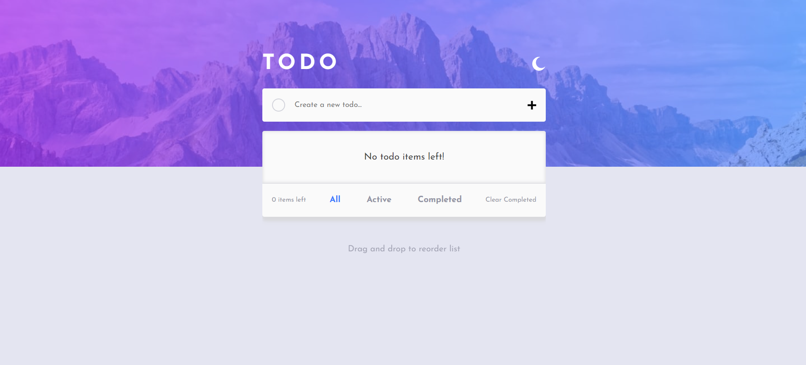

# Todo app

## [View](https://github.com/Vaswata/Project-2-Todo-App/) this site.

## Welcome! 👋

Thanks for checking out my website

**To do this challenge, we need a good understanding of HTML, CSS and JavaScript.**

## How its done

Our challenge is to build out this todo app and get it looking as close to the design as possible.

We users will be able to:

- View the optimal layout for the app depending on their device's screen size
- See hover states for all interactive elements on the page
- Add new todos to the list
- Mark todos as complete
- Delete todos from the list
- Filter by all/active/complete todos
- Clear all completed todos
- **Bonus**: Drag and drop to reorder items on the list

## Live Site

View site here - [Live Site](https://github.com/Vaswata/Project-2-Todo-App/)
